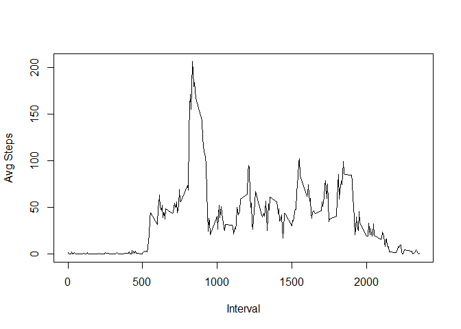

# Reproducible Research Assignment:Week2
20.08.2017  
#Loading and preprocessing the data
1.Load the data (i.e. read.csv())

```r
library("RCurl")
```

```
## Loading required package: bitops
```

```r
filename<-"repdata%2Fdata%2Factivity.zip"
#Downloading the data-set if its absent from the working directory.
if(!file.exists(filename)){fileURL <- "http://d396qusza40orc.cloudfront.net/repdata%2Fdata%2Factivity.zip"
download.file(fileURL,filename,method="libcurl")}
unzip(filename)
#reading data into the workspace
ObsData<-read.csv("activity.csv",header = T)
```
2.Process/transform the data (if necessary) into a format suitable for your analysis

```r
head(ObsData)
```

```
##   steps       date interval
## 1    NA 2012-10-01        0
## 2    NA 2012-10-01        5
## 3    NA 2012-10-01       10
## 4    NA 2012-10-01       15
## 5    NA 2012-10-01       20
## 6    NA 2012-10-01       25
```

```r
summary(ObsData)
```

```
##      steps                date          interval     
##  Min.   :  0.00   2012-10-01:  288   Min.   :   0.0  
##  1st Qu.:  0.00   2012-10-02:  288   1st Qu.: 588.8  
##  Median :  0.00   2012-10-03:  288   Median :1177.5  
##  Mean   : 37.38   2012-10-04:  288   Mean   :1177.5  
##  3rd Qu.: 12.00   2012-10-05:  288   3rd Qu.:1766.2  
##  Max.   :806.00   2012-10-06:  288   Max.   :2355.0  
##  NA's   :2304     (Other)   :15840
```

```r
length(unique(ObsData[,3]))
```

```
## [1] 288
```
#What is mean total number of steps taken per day?
1.Make a histogram of the total number of steps taken each day

```r
library("ggplot2")
tmp_days<-aggregate(steps~date,data = ObsData,sum,na.rm=T)
qplot(x=tmp_days$steps,binwidth=500, xlab="Steps/day")
```

<!-- -->

2.Calculate and report the **mean** and **median** total number of steps taken per day

```r
tmp_dmean<-mean(tmp_days$steps)
tmp_dmedian<-median(tmp_days$steps)
sprintf("Mean total number of steps taken is %f and the median total number of steps taken each day is %f",tmp_dmean,tmp_dmedian)
```

```
## [1] "Mean total number of steps taken is 10766.188679 and the median total number of steps taken each day is 10765.000000"
```
#What is the average daily activity pattern?
1.Make a time series plot (i.e. type = "l") of the 5-minute interval (x-axis) and the average number of steps taken, averaged across all days (y-axis)

```r
tmp_intervals<-aggregate(steps~interval, data=ObsData,mean, na.rm=T)
plot(tmp_intervals$interval,tmp_intervals$steps,type='l',xlab='Interval',ylab='Avg Steps')
```

<!-- -->

2.Which 5-minute interval, on average across all the days in the dataset, contains the maximum number of steps?

```r
tmp_a<-tmp_intervals$interval[tmp_intervals$steps==max(tmp_intervals$steps)]
tmp_b<-max(tmp_intervals$steps)
sprintf("Interval %i has the maximum average over all days with value %f.",tmp_a,tmp_b)
```

```
## [1] "Interval 835 has the maximum average over all days with value 206.169811."
```
#Imputing missing values
Note that there are a number of days/intervals where there are missing values (coded as NA). The presence of missing days may introduce bias into some calculations or summaries of the data.

1.Calculate and report the total number of missing values in the dataset (i.e. the total number of rows with NAs)

```r
tmp_a<-is.na(ObsData$steps)#missing interval or day makes no sense
tmp_b<-as.data.frame(table(tmp_a))
sprintf("The total number of missing(NA) values are %i.",tmp_b$Freq[tmp_b$tmp_a==TRUE])
```

```
## [1] "The total number of missing(NA) values are 2304."
```
2.Devise a strategy for filling in all of the missing values in the dataset. The strategy does not need to be sophisticated. For example, you could use the mean/median for that day, or the mean for that 5-minute interval, etc.

```r
#there are be many possible ways  to deal with missing values, the obviouse being taking the mean values.(For simplicity).
```
3.Create a new dataset that is equal to the original dataset but with the missing data filled in.

```r
ObsData_I<-ObsData
for (i in tmp_intervals$interval){
  ObsData_I[ObsData_I$interval==i & is.na(ObsData_I$steps),]$steps<-tmp_intervals$steps[tmp_intervals$interval==i]
}
```
4.Make a histogram of the total number of steps taken each day and Calculate and report the mean and median total number of steps taken per day. Do these values differ from the estimates from the first part of the assignment? What is the impact of imputing missing data on the estimates of the total daily number of steps?

```r
tmp_days_I<-aggregate(steps~date,data = ObsData_I,sum)
tmp_dmean<-mean(tmp_days_I$steps)
tmp_dmedian<-median(tmp_days_I$steps)
sprintf("The new mean is %f and the median is %f",tmp_dmean,tmp_dmedian)
```

```
## [1] "The new mean is 10766.188679 and the median is 10766.188679"
```

```r
#here we can see that the median value is the same as the mean value. This is the direct result of the imputation performed. Since now more and more number of values hold their overall
#average values as their own, the sheer occurance of mean in the overall variable has caused the median to centre on the mean.
#In simpler terms, previously because of missing values, median value differed from the mean because the individual variable under consideration was not 'centered' around just the mean.
#apart form this, there can not be any notable change in the mean value.
qplot(x=tmp_days_I$steps,binwidth=500, xlab="Steps/day")
```

<!-- -->

#Are there differences in activity patterns between weekdays and weekends?
For this part the weekdays() function may be of some help here. Use the dataset with the filled-in missing values for this part.

1.Create a new factor variable in the dataset with two levels -- "weekday" and "weekend" indicating whether a given date is a weekday or weekend day.

```r
library("dplyr")
```

```
## 
## Attaching package: 'dplyr'
```

```
## The following objects are masked from 'package:stats':
## 
##     filter, lag
```

```
## The following objects are masked from 'package:base':
## 
##     intersect, setdiff, setequal, union
```

```r
ObsData_I<-mutate(ObsData_I,DayType=weekdays(as.Date(ObsData_I$date)))
for (j in 1:length(ObsData_I$DayType)){
  if (ObsData_I$DayType[j]=='Saturday'|ObsData_I$DayType[j]=='Sunday'){
  ObsData_I$DayType[j]<-'Weekend'}
  else {ObsData_I$DayType[j]<-'Weekday'}
}
```
2.Make a panel plot containing a time series plot (i.e. type = "l") of the 5-minute interval (x-axis) and the average number of steps taken, averaged across all weekday days or weekend days (y-axis).

```r
#The commands below are done to format the dataset to have avg steps vs interval then seperated using daytype
tmp_wd_I<-aggregate(steps~interval,data=subset(ObsData_I,DayType=='Weekday',select=c(steps,interval)),mean)
tmp_we_I<-aggregate(steps~interval,data=subset(ObsData_I,DayType=='Weekend',select=c(steps,interval)),mean)
tmp_a<-rep('Weekday',length(tmp_wd_I$interval))
tmp_b<-rep('Weekend',length(tmp_we_I$interval))
tmp_a<-cbind(tmp_wd_I,tmp_a)
tmp_b<-cbind(tmp_we_I,tmp_b)
names(tmp_a)[3]<-paste('DayType')
names(tmp_b)[3]<-paste('DayType')
tmp<-rbind(tmp_a,tmp_b)
#however im not fully convinced this is the most efficient way of doing this. any help in this part will be appreciated, thanks.

# and now the plot
qplot(interval,steps,data = tmp,facets = DayType~.,geom='line')
```

<!-- -->
